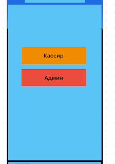
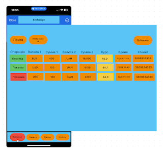
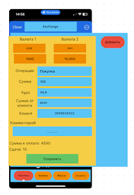

React Front-end ТЗ
Інструменти:

1. React
2. React Context
3. React Router DOM
4. UI бібліотека (будь-яка на вибір material-ui,ant-desing)
5. TypeScript буде плюсом
   Задача: Потрібно реалізувати апку під телефон (можна взяти Iphone 13). Мова UI не має значення.
   Під час реалізації задачі необхідно створити React проект, створити зручну структу папок і
   використати інструменти описані зверху.
   Етапи задачі:
6. Головна сторінка має вибір ролі
7. Після вибору ролі відкривається сторінка “Транзакції”.
   Тут потрібло реалізувати таблицю яка буде відображати дані що є на скріні. Для даних використати seeds.
8. Реалізувати кнопку “Добавить”.
   Після нажаття має відкриватись форма яка після заповнення буде додаватись до state який
   успадкований від seed.
9. Реалізувати навігацію по іншим сторінкам апки.
   Туди має бути можливість перейти але сторінки можуть бути пустими.
